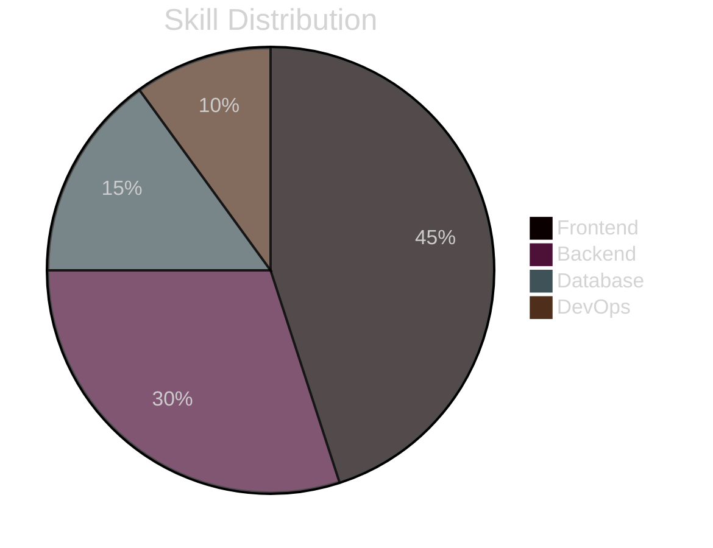

  

  

  
  

  
  
  
  

<!-- ABOUT ME SECTION -->

  <h2> About Me</h2>

<table>
  <tr>
    <td width="70%">
      
Hi there! 👋 I'm a passionate Full Stack Developer from Morocco with a love for creating elegant, efficient solutions to complex problems.

      
My journey in web development has equipped me with a diverse skill set spanning front-end aesthetics to back-end architecture. I enjoy crafting intuitive user experiences while ensuring robust functionality under the hood.

      <ul>
        <li>🚀 Currently diving deep into <b>Next.js</b></li>
        <li>💡 Always exploring new technologies and design patterns</li>
        <li>🌱 Lifelong learner with a growth mindset</li>
        <li>🔭 Looking to collaborate on innovative web projects</li>
        <li>💬 Ask me about <b>React, Laravel, MongoDB, JavaScript</b></li>
      </ul>
    </td>
    <td width="30%">
      
    </td>
  </tr>
</table>

<!-- TECH STACK SECTION -->

  <h2> Tech Universe</h2>

<table align="center" style="border-collapse: collapse; border: none; width: 100%;">
  <tr style="background-color: #0d1117;">
    <th style="padding: 15px; text-align: center; color: #58a6ff; border: 1px solid #30363d;">Frontend</th>
    <th style="padding: 15px; text-align: center; color: #58a6ff; border: 1px solid #30363d;">Backend</th>
    <th style="padding: 15px; text-align: center; color: #58a6ff; border: 1px solid #30363d;">Database</th>
    <th style="padding: 15px; text-align: center; color: #58a6ff; border: 1px solid #30363d;">DevOps & Tools</th>
  </tr>
  <tr>
    <td style="padding: 12px; text-align: center; border: 1px solid #30363d;">
      
    </td>
    <td style="padding: 12px; text-align: center; border: 1px solid #30363d;">
      
    </td>
    <td style="padding: 12px; text-align: center; border: 1px solid #30363d;">
      
    </td>
    <td style="padding: 12px; text-align: center; border: 1px solid #30363d;">
      
    </td>
  </tr>
  <tr>
    <td style="padding: 12px; text-align: center; border: 1px solid #30363d;">
      
    </td>
    <td style="padding: 12px; text-align: center; border: 1px solid #30363d;">
      
    </td>
    <td style="padding: 12px; text-align: center; border: 1px solid #30363d;">
      
    </td>
    <td style="padding: 12px; text-align: center; border: 1px solid #30363d;">
      
    </td>
  </tr>
  <tr>
    <td style="padding: 12px; text-align: center; border: 1px solid #30363d;">
      
    </td>
    <td style="padding: 12px; text-align: center; border: 1px solid #30363d;">
      
    </td>
    <td style="padding: 12px; text-align: center; border: 1px solid #30363d;">
      
    </td>
    <td style="padding: 12px; text-align: center; border: 1px solid #30363d;">
      
    </td>
  </tr>
  <tr>
    <td style="padding: 12px; text-align: center; border: 1px solid #30363d;">
      
    </td>
    <td style="padding: 12px; text-align: center; border: 1px solid #30363d;">
      
    </td>
    <td style="padding: 12px; text-align: center; border: 1px solid #30363d;">
      
    </td>
    <td style="padding: 12px; text-align: center; border: 1px solid #30363d;">
      
    </td>
  </tr>
  <tr>
    <td style="padding: 12px; text-align: center; border: 1px solid #30363d;">
      
    </td>
    <td style="padding: 12px; text-align: center; border: 1px solid #30363d;">
      
    </td>
    <td style="padding: 12px; text-align: center; border: 1px solid #30363d;">
      
    </td>
    <td style="padding: 12px; text-align: center; border: 1px solid #30363d;">
      
    </td>
  </tr>
  <tr>
    <td style="padding: 12px; text-align: center; border: 1px solid #30363d;">
      
    </td>
    <td style="padding: 12px; text-align: center; border: 1px solid #30363d;">
      
    </td>
    <td style="padding: 12px; text-align: center; border: 1px solid #30363d;">
      <!-- Empty cell for balance -->
    </td>
    <td style="padding: 12px; text-align: center; border: 1px solid #30363d;">
      
    </td>
  </tr>
</table>

<!-- SKILLS SECTION WITH CREATIVE VISUALIZATION -->

  <h2> Expertise Level</h2>

<table>
  <tr>
    <td>
      <h3>Frontend</h3>
      
<b>React</b> 

      
<b>JavaScript</b> 

      
<b>HTML/CSS</b> 

      
<b>TypeScript</b> 

    </td>
    <td>
      <h3>Backend</h3>
      
<b>Laravel</b> 

      
<b>Node.js</b> 

      
<b>Express</b> 

      
<b>PHP</b> 

    </td>
  </tr>
  <tr>
    <td>
      <h3>Database</h3>
      
<b>MongoDB</b> 

      
<b>MySQL</b> 

      
<b>Oracle SQL</b> 

      
<b>SQL Server</b> 

    </td>
    <td>
      <h3>DevOps & Tools</h3>
      
<b>Docker</b> 

      
<b>Kubernetes</b> 

      
<b>Git & CI/CD</b> 

      
<b>Linux</b> 

    </td>
  </tr>
  <tr>
    <td>
      <h3>Programming Languages</h3>
      
<b>C++</b> 

      
<b>Java</b> 

      
<b>C</b> 

    </td>
    <td>
      <!-- Empty cell for balance -->
    </td>
  </tr>
</table>

<!-- GITHUB STATS SECTION -->

  <h2> GitHub Analytics</h2>
  
  <picture>
    <source media="(prefers-color-scheme: dark)" srcset="https://github-readme-stats.vercel.app/api?username=bilaleh&show_icons=true&bg_color=1e1e2e&text_color=cdd6f4&icon_color=cba6f7&title_color=94e2d5&hide_border=true&count_private=true&include_all_commits=true&card_width=500">
    <source media="(prefers-color-scheme: light)" srcset="https://github-readme-stats.vercel.app/api?username=bilaleh&show_icons=true&theme=buefy&hide_border=true&count_private=true&include_all_commits=true&card_width=500">
    
  </picture>
  
  <picture>
    <source media="(prefers-color-scheme: dark)" srcset="https://github-readme-stats.vercel.app/api/top-langs/?username=bilaleh&layout=compact&bg_color=1e1e2e&text_color=cdd6f4&icon_color=cba6f7&title_color=94e2d5&hide_border=true&langs_count=8&card_width=500">
    <source media="(prefers-color-scheme: light)" srcset="https://github-readme-stats.vercel.app/api/top-langs/?username=bilaleh&layout=compact&theme=buefy&hide_border=true&langs_count=8&card_width=500">
    
  </picture>

  <picture>
    <source media="(prefers-color-scheme: dark)" srcset="https://streak-stats.demolab.com?user=bilaleh&theme=catppuccin-mocha&hide_border=true&border_radius=8&date_format=j%20M%5B%20Y%5D&card_width=1000">
    <source media="(prefers-color-scheme: light)" srcset="https://streak-stats.demolab.com?user=bilaleh&theme=buefy&hide_border=true&border_radius=8&date_format=j%20M%5B%20Y%5D&card_width=1000">
    
  </picture>

<!-- WORK SHOWCASE SECTION -->

  <h2> Highlighted Projects</h2>

  <table>
    <tr>
      <td width="50%">
        <h3 align="center">Project 1</h3>
        

          
        

        

          <strong>React.js, Node.js, MongoDB</strong> - A full-stack web application for [project description].
        

        

          
          
        

      </td>
      <td width="50%">
        <h3 align="center">Project 2</h3>
        

          
        

        

          <strong>Laravel, MySQL, Vue.js</strong> - A web application that [project description].
        

        

          
          
        

      </td>
    </tr>
  </table>

<!-- CODING ACTIVITY SECTION -->

  <h2> Weekly Coding Stats</h2>

  

<!-- QUOTE SECTION -->

  <h2> Quote of the Day</h2>
  

<!-- SPOTIFY SECTION -->

  <h2> Music Vibes</h2>
  
  
🎵 Currently vibing to coding playlists while building amazing web experiences!

<!-- CONNECT SECTION -->

  <h2> Let's Connect</h2>
  
I'm always interested in collaborating on innovative projects and ideas. Feel free to reach out!

  
  
  
  

<!-- FOOTER -->

  

