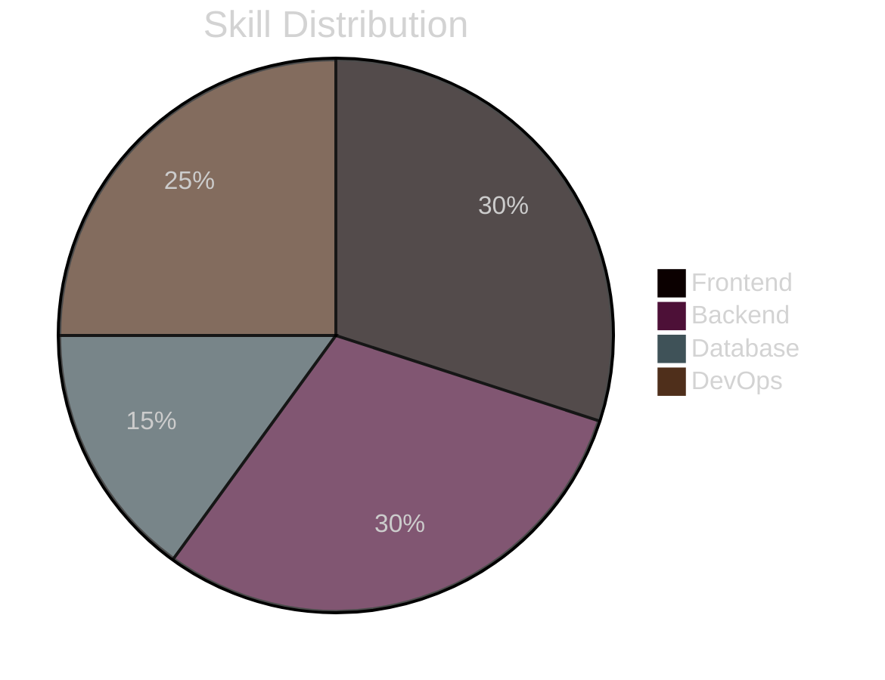

  

  

  

  
  
  
  

<!-- ABOUT ME SECTION -->

  <h2> About Me</h2>

<table>
  <tr>
    <td width="70%">
      
Hi there! 👋 I'm a passionate Full Stack Developer from Morocco with a love for creating elegant, efficient solutions to complex problems.

      
My journey in web development has equipped me with a diverse skill set spanning front-end aesthetics to back-end architecture. I enjoy crafting intuitive user experiences while ensuring robust functionality under the hood.

      <ul>
        <li>🚀 Currently diving deep into <b>Next.js</b></li>
        <li>💡 Always exploring new technologies and design patterns</li>
        <li>🌱 Lifelong learner with a growth mindset</li>
        <li>🔭 Looking to collaborate on innovative web projects</li>
        <li>💬 Ask me about <b>React, Laravel, MongoDB, JavaScript</b></li>
      </ul>
    </td>
    <td width="30%">
      
    </td>
  </tr>
</table>

<!-- TECH STACK SECTION -->

  <h2> Tech Universe</h2>
  

<!-- SKILLS SECTION WITH CREATIVE VISUALIZATION -->

  <h2> Expertise Level</h2>

  <table>
    <tr>
      <th align="center">Frontend</th>
      <th align="center">Backend</th>
    </tr>
    <tr>
      <td align="center">
        React 
        
      </td>
      <td align="center">
        Laravel 
        
      </td>
    </tr>
    <tr>
      <td align="center">
        JavaScript 
        
      </td>
      <td align="center">
        Node.js 
        
      </td>
    </tr>
    <tr>
      <td align="center">
        HTML/CSS 
        
      </td>
      <td align="center">
        Express 
        
      </td>
    </tr>
    <tr>
      <td align="center">
        TypeScript 
        
      </td>
      <td align="center">
        PHP 
        
      </td>
    </tr>
    <tr>
      <th align="center">Database</th>
      <th align="center">DevOps & Tools</th>
    </tr>
    <tr>
      <td align="center">
        MongoDB 
        
      </td>
      <td align="center">
        Docker 
        
      </td>
    </tr>
    <tr>
      <td align="center">
        MySQL 
        
      </td>
      <td align="center">
        Kubernetes 
        
      </td>
    </tr>
    <tr>
      <td></td>
      <td align="center">
        Git & CI/CD 
        
      </td>
    </tr>
  </table>

<!-- GITHUB STATS SECTION -->

  <h2> GitHub Analytics</h2>
  
  <picture>
    <source media="(prefers-color-scheme: dark)" srcset="https://github-readme-stats.vercel.app/api?username=bilaleh&show_icons=true&bg_color=1e1e2e&text_color=cdd6f4&icon_color=cba6f7&title_color=94e2d5&hide_border=true&count_private=true&include_all_commits=true&card_width=500">
    <source media="(prefers-color-scheme: light)" srcset="https://github-readme-stats.vercel.app/api?username=bilaleh&show_icons=true&theme=buefy&hide_border=true&count_private=true&include_all_commits=true&card_width=500">
    
  </picture>
  
  <picture>
    <source media="(prefers-color-scheme: dark)" srcset="https://github-readme-stats.vercel.app/api/top-langs/?username=bilaleh&layout=compact&bg_color=1e1e2e&text_color=cdd6f4&icon_color=cba6f7&title_color=94e2d5&hide_border=true&langs_count=8&card_width=500">
    <source media="(prefers-color-scheme: light)" srcset="https://github-readme-stats.vercel.app/api/top-langs/?username=bilaleh&layout=compact&theme=buefy&hide_border=true&langs_count=8&card_width=500">
    
  </picture>

  <picture>
    <source media="(prefers-color-scheme: dark)" srcset="https://streak-stats.demolab.com?user=bilaleh&theme=catppuccin-mocha&hide_border=true&border_radius=8&date_format=j%20M%5B%20Y%5D&card_width=1000">
    <source media="(prefers-color-scheme: light)" srcset="https://streak-stats.demolab.com?user=bilaleh&theme=buefy&hide_border=true&border_radius=8&date_format=j%20M%5B%20Y%5D&card_width=1000">
    
  </picture>

<!-- WORK SHOWCASE SECTION -->

  <h2> Highlighted Projects</h2>

  <table>
    <tr>
      <td width="50%">
        <h3 align="center">Project 1</h3>
        

          
        

        

          <strong>React.js, Node.js, MongoDB</strong> - A full-stack web application for [project description].
        

        

          
          
        

      </td>
      <td width="50%">
        <h3 align="center">Project 2</h3>
        

          
        

        

          <strong>Laravel, MySQL, Vue.js</strong> - A web application that [project description].
        

        

          
          
        

      </td>
    </tr>
  </table>

<!-- CODING ACTIVITY SECTION -->

  <h2> Weekly Coding Stats</h2>

  

<!-- QUOTE SECTION -->

  <h2> Quote of the Day</h2>
  

<!-- CONNECT SECTION -->

  <h2> Let's Connect</h2>
  
I'm always interested in collaborating on innovative projects and ideas. Feel free to reach out!

  
  
  
  

<!-- SPOTIFY SECTION WITH RELIABLE IMAGE -->

  <h2> Music Vibes</h2>
  <!-- Using a more reliable image method instead of dynamically generated content -->
  <table>
    <tr>
      <td align="center">
        
        
🎵 Currently listening to coding playlists

      </td>
    </tr>
  </table>

<!-- FOOTER -->

  

